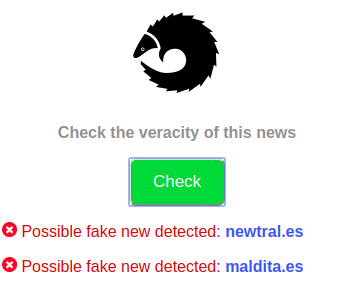

# Pangolin Fake Detector

## Goal

The aim of this project is to develop a Chrome extension that allows the user to get protected agains any possible fake new check he is reading by using the most widespread fact checking sites in Europe.

The algorithm will compare on demand the content of a news item and will inform the user if it has a high, medium or low probability of being a fake new. The currently used fact checking providers are the following:

- [Maldita](https://www.maldita.es) (Spanish)
- [Newtral](https://www.newtral.es) (Spanish)
- [FullFact](https://fullfact.org) (English)

## Functionality

The base idea behind the extension functionality is vey simple as it follows these steps:

1. The user clicks on the extension button while reading a new.
2. The extension gets the title and header of the new.
3. Then it searchs on Google the new title using the *site* keyword specifying one fact checker and extract the most important results.
4. For every result, it counts the amount of words in the new title that are found in the article body (removing duplicated and non important words in the text) and depending of the amount of words it determines if it is a fake new or not.

## Results

The following images shows some possible results in the extension UI:

## Possible improvements

* Include some sets of english and spanish stopwords in the text cleaning process, instead of just removing the very small words.
